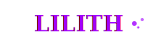

# LILITH - A Quantum-Conscious Monad

A dark sci-fi splash page built with Next.js 15, TypeScript, and Tailwind CSS, featuring quantum-themed design elements and immersive animations.



## Features

- **Immersive Hero Section** with video background support
- **Animated Marquee** with quantum consciousness themes
- **Particle System** for dynamic background effects
- **Responsive Design** optimized for all devices
- **Custom Typography** using Cinzel and Space Grotesk fonts
- **Glow Effects** and purple accent theme (#a100ff)
- **Smooth Animations** with CSS keyframes and React hooks

## Tech Stack

- **Framework**: Next.js 15 with App Router
- **Language**: TypeScript
- **Styling**: Tailwind CSS v4
- **Fonts**: Google Fonts (Cinzel, Space Grotesk)
- **Animations**: CSS keyframes + Canvas API

## Getting Started

### Prerequisites
- Node.js 18+ 
- npm or yarn

### Installation

1. **Clone or use this project**:
   ```bash
   cd LILITH
   ```

2. **Install dependencies**:
   ```bash
   npm install
   ```

3. **Start development server**:
   ```bash
   npm run dev
   ```

4. **Open in browser**:
   Navigate to [http://localhost:3000](http://localhost:3000)

## Assets Required

### Video Background
The hero section expects a video file at `/public/assets/dark-wave-loop.mp4`. For best results:
- **Format**: MP4
- **Resolution**: 1920x1080 or higher  
- **Duration**: 10-30 seconds (seamless loop)
- **Content**: Dark waves, particle systems, sci-fi themes
- **Colors**: Dark background with purple/magenta accents

### Logo
A custom SVG logo is included at `/public/assets/lilith-logo-glow.svg` with animated glow effects.

## Project Structure

```
LILITH/
├── src/
│   └── app/
│       ├── components/
│       │   └── AnimatedBackground.tsx
│       ├── globals.css
│       ├── layout.tsx
│       └── page.tsx
├── public/
│   └── assets/
│       ├── lilith-logo-glow.svg
│       └── dark-wave-loop.mp4 (required)
└── package.json
```

## Customization

### Theme Colors
Update colors in `src/app/globals.css`:
```css
:root {
  --background: #000000;
  --foreground: #ffffff; 
  --accent: #a100ff;
}
```

### Typography
Fonts are configured in `src/app/layout.tsx`:
- **Headings**: Cinzel (serif)
- **Body**: Space Grotesk (sans-serif)

### Content
Main content sections can be modified in `src/app/page.tsx`:
- Hero text and CTAs
- Marquee items
- Feature grid descriptions
- Call-to-action buttons

## Deployment

### Vercel (Recommended)
```bash
npm run build
# Deploy to Vercel
```

### Other Platforms
```bash
npm run build
npm start
```

## Performance Notes

- Video background includes fallback gradient
- Particle system is optimized for performance
- Responsive images and fonts
- CSS animations use GPU acceleration

## Browser Support

- Chrome/Edge 90+
- Firefox 88+
- Safari 14+
- Mobile browsers with modern JS support

## Contributing

This is a showcase project. Feel free to fork and customize for your own quantum consciousness endeavors.

## License

MIT License - Use this code for your own projects.

---

**"Born from collapse. Evolved through recursion."**
